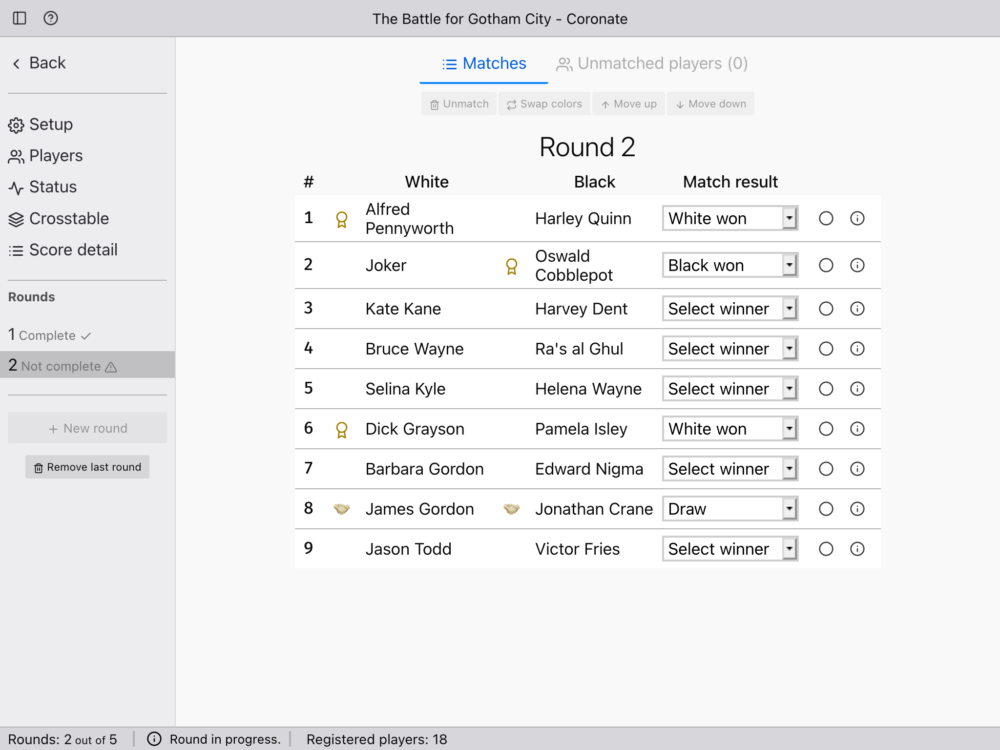
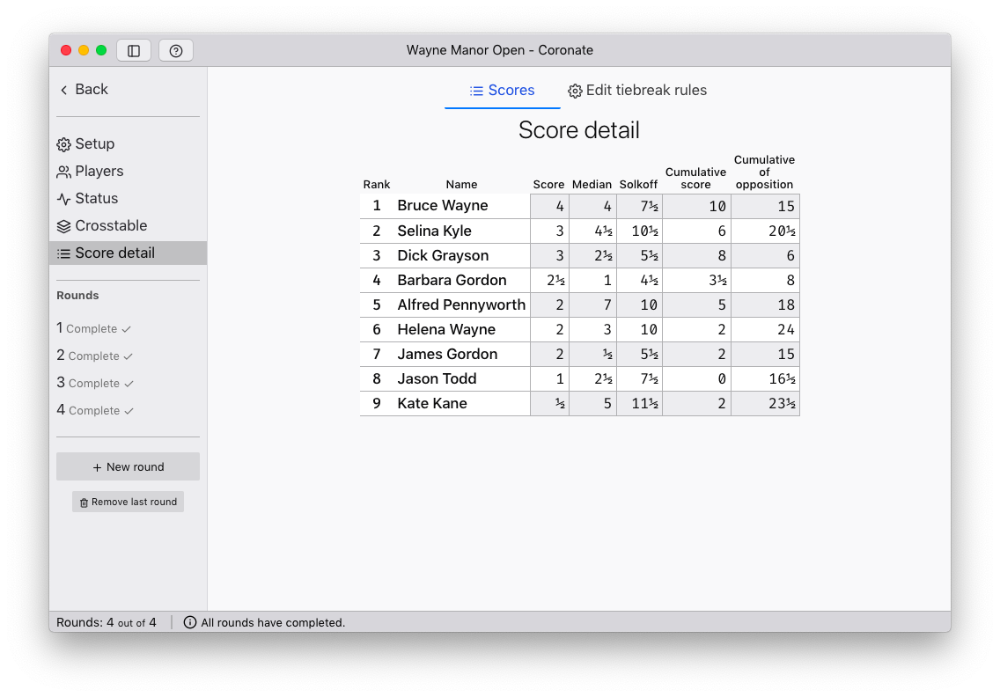

<div align="center">

<h1>Coronate</h1>
</div>

<p align="center">Coronate is a web app for managing Swiss-style chess tournaments.</p>

## 🧐 About

Coronate is a free alternative to pricey professional tournament software.
Anyone, even a tournament newbie with a locked-down public-access computer, can
use it to run their tournament.

<p align="center"><a href="https://johnridesa.bike/coronate/">👉 Click here for a live demo ♟</a></p>

[Read more about how to use the app here](https://johnridesa.bike/software/coronate/).




## 🥰 Enjoy using Coronate?

Coronate is free software, but you're welcome to show your appreciation.

<a href="https://www.buymeacoffee.com/johnridesabike" target="_blank">
  
</a>

## 🏁 Getting started

These are the basic steps you'll need to follow to get a development copy of
Coronate running on your machine:

### Prerequisites

You'll need [Node.js](https://nodejs.org/) version 13. Coronate probably runs
on other versions too, but it's not tested on them.

### Installing

#### 1: Grab the code

For most people, the easiest method is to click the "Clone or Download" button
on [this project's GitHub homepage](https://github.com/johnridesabike/coronate).

If you have Git installed, you can also run:
```
git clone https://github.com/johnridesabike/coronate.git
```

If you want to make your own changes, then it's recommended to fork the
repository on GitHub and clone your forked version.

#### 2: Install the dependencies

Once you have a local copy of the code, run this command in the project's
directory to install its dependencies:
```
npm install
```

## 🎈 Usage

Coronate works completely in your local browser. Running it only requires two 
commands.

First run this to compile the ReScript source:
```
npm run build:res
```

Alternatively, you can run the compiler in watch mode:
```
npm run start:res
```

Then run this to start the app:
```
npm start
```

And then open this URL: `http://localhost:3000`.

Because it keeps your data in your browser's storage, be mindful that data loss
can happen unexpectedly depending on your settings. The app's "options" page has
a button to back up your data in an external file.

## 🔧 Running the tests

Just as with using the live version, you need to run `npm run build:res` first.

Then you can run the tests with the command:
```
npm test
```

## 🚀 Deployment 

To create an optimized version that can be uploaded to your own website, run:

```
npm run build
```

## ⛏️ Built using

- [Node.js](https://nodejs.org/en/) - JavaScript
- [ReScript](https://rescript-lang.org/) - most of the code
- [React](https://rescript-lang.org/docs/react/latest/introduction) - interface
- [LocalForage](https://localforage.github.io/localForage/) - browser storage
- [Feather](https://feathericons.com/) - icons

## ✍️ Authors

- [@johnridesabike](https://github.com/johnridesabike) - Idea and initial work

## 🎉 Acknowledgements 

The three "kings" in the logo are derived from the Mérida chess font, which was 
informally licensed as "freeware."

Some human interface decisions (colors, buttons, etc.) are based on the
[Photon Design System](https://design.firefox.com/photon/) for an elegant,
OS-neutral, appearance.
