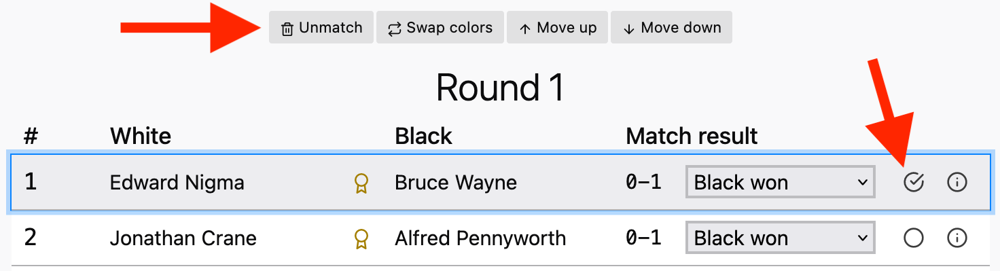

## What is the (simplest) way to use this program on my computer?

Visit this link: [coronate.netlify.app].

[coronate.netlify.app]: https://coronate.netlify.app/

## Can I only use this program in a browser?

Yes, this way it can be used on any OS.

## I have an Apple / Windows / Linux computer, can I use Coronate ?

Yes, use your favorite browser.

## Can I run my own version of this program on my computer?

Yes, the source code is free to use and requires minimal system dependencies.
See the [development section] of the readme for more information.

[development section]:
  https://github.com/johnridesabike/coronate?tab=readme-ov-file#development

## How can I try out how Coronate works?

Use the "Click here to load the demo data" button to get dummy tournaments. You
can remove all or some of the players, add players yourself, or change the
names. You can even start a fresh empty tournament with the "Add tournament"
button in the "Tournaments" tab.

For each tournament, you can select which players to include or include "all."

There is no need to set your total amount of rounds to be played. Coronate uses
Swiss tournament rules to automatically calculate the following rounds.

## Can I do a tournament with only 4 players ?

Yes, and this is the minimum. With any number of players, when many rounds are
played the program may pair some players again, but preferably with colors
reversed.

## What is the maximum number of players in a tournament ?

There's no hard limit. So far we haven't found a number that will make it crash
though.

## Can I add new players after some rounds are played ?

Yes, sometimes people want to join later, it happens. Before each new round you
can add players to the list, or unselect players which want to skip a round or
just leave.


## Can I save / export all results up to a certain round and later use those to continue the same tournament?

Yes, all your data can be exported to a single JSON file, a common open data
format. Later you can load that file, see the Options page.

## Can I alter the exported tournament .JSON file?

This is not recommended. You might corrupt the tournament (JSON) file if you
don't know what you're doing. It's best to change any settings, e.g. player
names, by the program menus.

## Can I change a player name?

Yes. In the "Players" tab of the main menu, click on the player you want to edit
and you can change their name on the form that displays.


## Can I remove a player from the tournament ?

Yes. In the "Players" tab of the tournament screen, click the "Edit player
roster" button. From there, you can uncheck the player you want to remove.

This will exclude the player from any future matches. It will not affect any
matches they already played.


## Can I force / fix a pairing?

Yes. From the round screen, elect the pairing(s) you want to remove and click
the "Unmatch" button. Then, on the "Unmatched players" tab, manually add the two
players you want to pair and click the "Match selected" button.




## Can I force that a player pairing will never be made?

Yes. On the "Players" tab of the home screen, select one of the players. Then
find the other player on the "players to avoid" dropdown menu. Click "Add" to
force them to avoid each other.

This will practically guarantee that they will never match. It may still be
possible to artificially force them to match in pathological situations, though
(e.g. if every other player was also told to avoid them too).


## Can I have groups in the tournament?

No, this feature is not implemented (yet).

## How is rating calculated according to the results?

If player with rating `r1` earns `s` score against player with rating `r2`, and
has match count `c`, then:

```
k_factor = if c < 30 then 40 else if r1 > 2100 then 10 else 20
expected = 1 / (1 + 10 ^ ((r2 - r1) / 400))
new_rating = r1 + k_factor * (s - expected)
```

Score `s` is `1` if the player won, `0` if they lost, and `1/2` if they drew.

I copied these formulas from Wikipedia. They're a best-effort for a small
tournament, and I don't recommend using Coronate as an authoritative rating
calculator.

## How can I set a number of rounds for my tournament?

The Swiss system automatically sets the number of rounds based on your number of
players. You can manually add extra rounds if you really want to, though.

## How is the automatic pairing done?

Coronate uses the Swiss system. This automatically calculates the most efficient
series of pairings to determine a winner in the smallest number of rounds. It
mainly pairs players according to their scores from past rounds, and avoids that
any two players meet.

To make the Swiss system work, Coronate mainly pairs players by their scores. It
also looks at their ratings and tries to balance each player's "white" and
"black" turns, although those are less important.

If you don't like the automatic pairing, you can manually pair players too.

## How can I review the results of previous rounds?

On the tournament screen, click on each numbered round under the "Rounds" in the
sidebar.


## How can I see the current standings?

On the tournament screen, click on the "Score detail" on the sidebar.

## Can I print a current screen?

No, there's no print function inside the program, but your browser can print any
(web based) page, also create a (PDF) file.

## Can I undo / remove a complete round?

You can remove the most recent round with the "Remove last round" button on the
tournament screen. To remove a round before that, you have to remove the rounds
that came after it first.

## Can I prevent a pairing of players with high rating difference?

Normally this is done automatically, the program always finds a best suitable
opponent, according to rating and tournament results so far.

## Can I adjust the way the automatic pairing works? The Swiss system in my country differs.

No, Coronate uses a hard-coded set of rules which are not (yet) customizable.
